# Lab 7
Inicializar
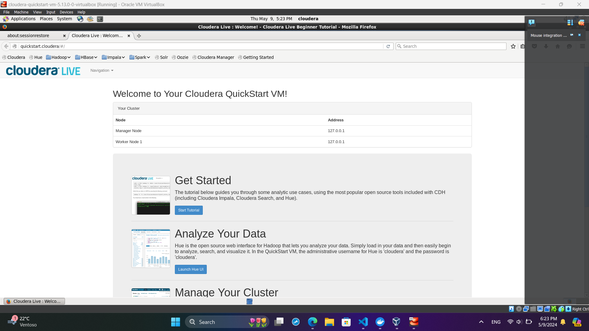

## EJERCICIO 01
hdfs dfs
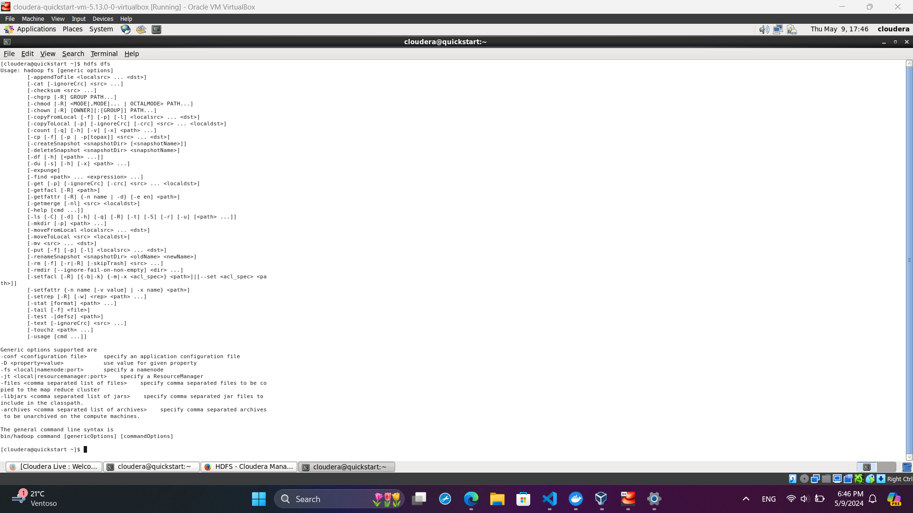

hdfs dfs --help
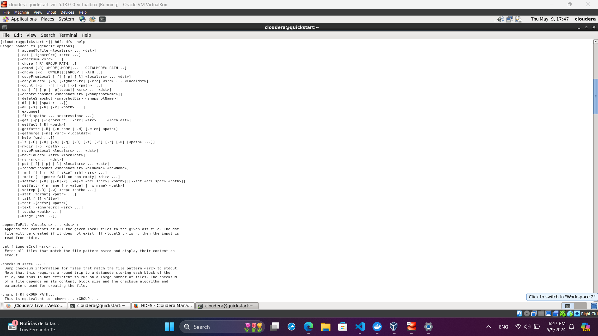
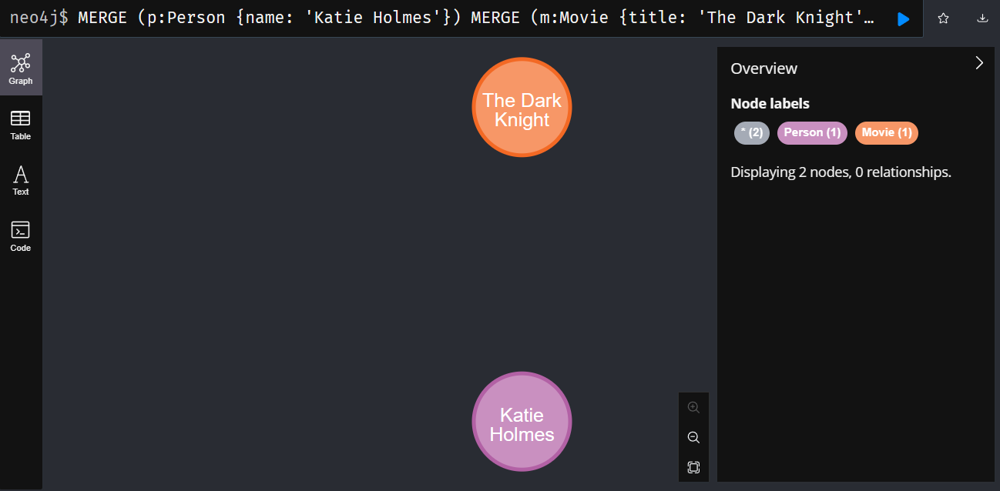

hdfs dfs --help ls
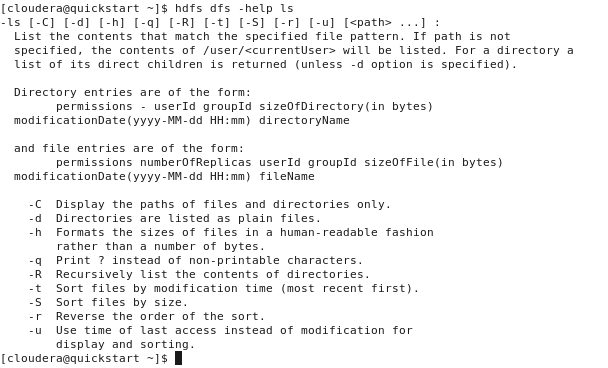

hdfs dfs -ls file:///usr
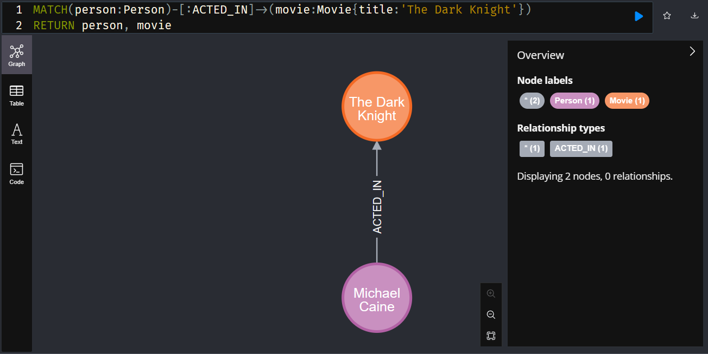

hdfs dfs -ls hdfs:///user
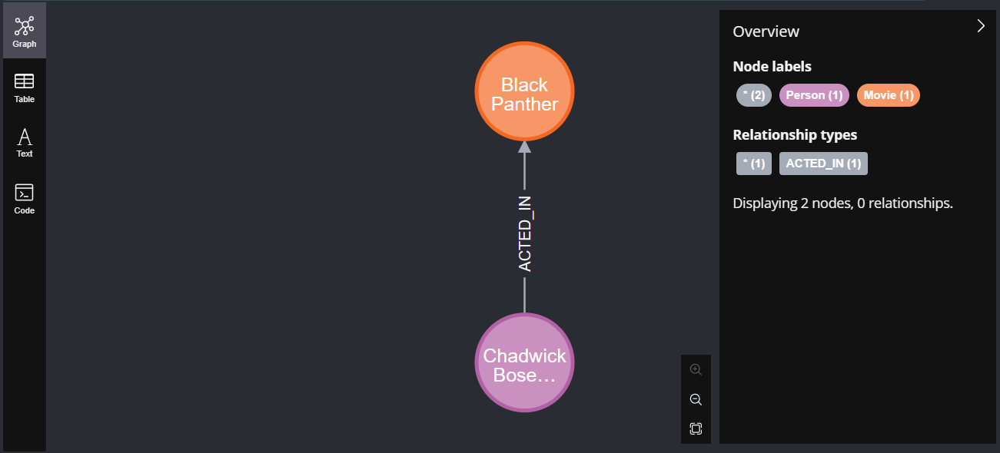

hdfs dfs -ls /user
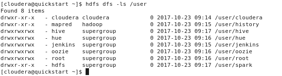

## EJERCICIO 02

hdfs dfs -ls /
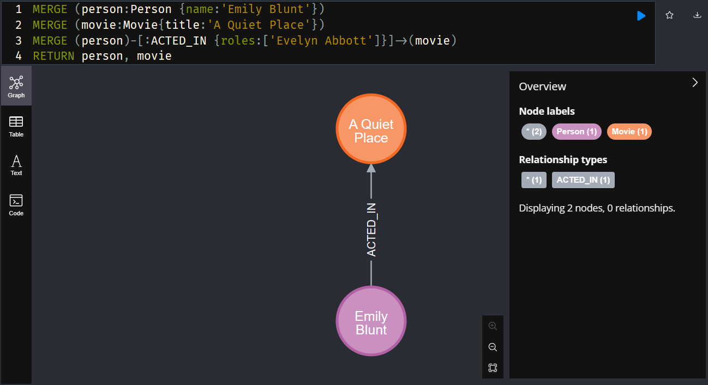

hdfs dfs -ls

hdfs dfs -mkdir -p dir1/dir2/dir3
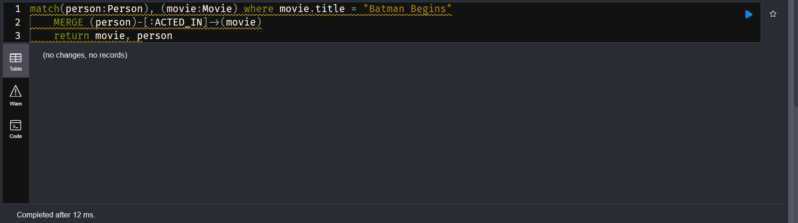

hdfs dfs -ls dir1
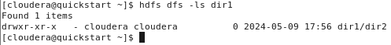

hdfs dfs -ls /user/cloudera/dir1
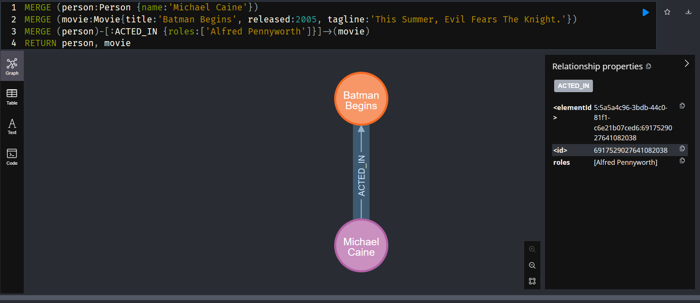

hdfs dfs -ls -R

## EJERCICIO 03
