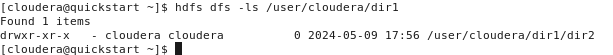

# Lab 7
Inicializar

## EJERCICIO 01
hdfs dfs

hdfs dfs --help

hdfs dfs --help ls

hdfs dfs -ls file:///usr

hdfs dfs -ls hdfs:///user

hdfs dfs -ls /user

## EJERCICIO 02

hdfs dfs -ls /

hdfs dfs -ls

hdfs dfs -mkdir -p dir1/dir2/dir3

hdfs dfs -ls dir1

hdfs dfs -ls /user/cloudera/dir1

hdfs dfs -ls -R

## EJERCICIO 03

Ejercicio 3:
Copiar el archivo (constitution.txt) del file system local hacia el home directory del usuario cloudera dentro de HDFS. Liste el directorio destino evidenciando que se haya copiado el archivo.

Despliegue el contenido del archivo constitution.txt que se encuentra en HDFS

Despliegue únicamente el final del archivo (1 KB). Use la función tail.

Mueva el archivo desde su ubicación actual al dir3 que se creó previamente.

Liste el directorio padre de forma recursiva para evidenciar esto

Ahora, traiga el archivo de regreso al file system local (el origen debería ser el directorio del paso anterior) bajo el nombre de constitution_download.txt

Copie a HDFS el archivo /etc/passwd en la carpeta del directorio home del usuario cloudera.
Copie a HDFS el archivo /etc/hosts en la carpeta del directorio home del usuario cloudera
Utilice el comando -getmerge para copiarlos de vuelta al file system como un único archivo en la carpeta Documents bajo el nombrepasswd_hosts

Despliegue el contenido del archivo en cuestión en el sistema operativo

Ahora borremos el archivo passwd del directorio home del usuario cloudera dentro de Cloudera Express, luego listemos el directorio para verificar que se ha eliminado.

¿Qué mensaje recibió cuando eliminó el archivo passwd?, y cuando se listó el contenido del directorio home en HDFS ¿notó que ahora hay un nuevo directorio .Trash? Investigue qué significa este directorio y lo que almacena.
Cuando eliminas un archivo en HDFS, recibirás un mensaje indicando que el archivo fue eliminado exitosamente. La aparición de un nuevo directorio .Trash en el directorio home en HDFS significa que se ha habilitado la papelera de reciclaje y que los archivos eliminados se mueven a este directorio en lugar de ser eliminados permanentemente. Puedes restaurar archivos eliminados de la papelera de reciclaje si es necesario.
