# Lab 5 - Cypher Neo4j
Este es la branch en la cuál se realizó el laboratorio 5 de Neo4j.

## Ejercicio 1 - Análisis General
* ¿Qué opiniones tiene sobre este grafo?
    Parece ser un grafo conexo de manera que todos los nodos están conectados y no hay nodos sueltos. Hay más nodos persona que nodos de películas lo que tiene sentido dado que existen más actores por cada película generada.
* ¿Considera que puede sacar algunas conclusiones sobre las relaciones que encuentra visualizadas? En caso contrario, ¿por qué? ¿qué necesitaría para sacar conclusiones?
    Considero que una conclusión que puedo obtener es que es un grafo dirigido ya que la relación es la siguiente. 
     
    Así mismo, otra conclusión que puedo sacar es que basado en teoría de grafos que no tiene un paseo euleriano (_Un circuito hamilton en un grafo es un circuito que pasa a través de cada vértice del grafo una y sólo una vez_) debido a que múltiples personas trabajan en una misma película y en múltiples películas hay personas que solo han trabajado en esa película. Por ello es casi imposible que haya un circuito hamilton.
* Analice el propósito de explorar información de esta manera.
    Es importante analizar la información de esta manera por varias razones, entre las que están:
    * Ver una  aproximación de cómo es que está conectada la data.
    * Visualizar patrones sobre la data que podríamos analizar ya en código.

## Ejercicio 2 - Interacciones con Cypher
* Cree un nodo nuevo de tipo persona con el nombre del actor Michael Caine. Utilice la sentencia MERGE para evitar crear nodos duplicados.

* Verifique que se haya creado el nodo con la sentencia MATCH.

* También puede utilizar muchas sentencias merge dentro de un mismo query de cypher. Ejecute la siguiente sentencia: 
    _MERGE (p:Person {name: 'Katie Holmes'})
    MERGE (m:Movie {title: 'The Dark Knight'})
    RETURN p, m_
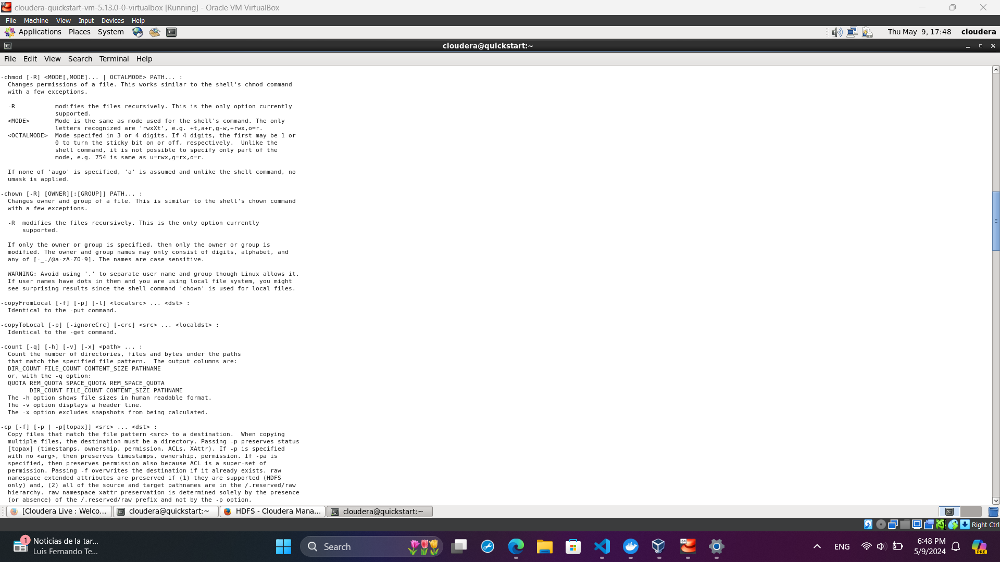
* Como se revisó en la sesión, se podrá utilizar la sentencia MERGE también para crear relaciones. Cree una relación ACTED_IN para el actor Michael Caine y la película The Dark Night.

* Verifique que esa relación existe.
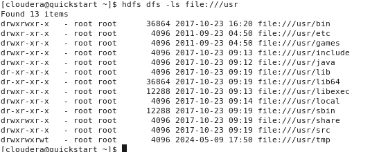
* Ahora, unifique los conocimientos del paso 3 y resto de pasos para que, con una misma sentencia, utilice una cadena de comandos MERGE
para crear un nodo persona con el nombre Chadwick Boseman, un nodo de tipo película con el título Black Panther y la relación ACTED_IN.
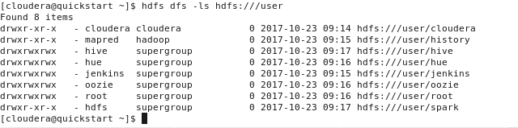
* Confirme que la relación haya funcionado.

* Ahora, con el resultado del comando anterior (paso 6), modifique el query para que en una misma consulta MERGE cree un nodo persona (Emily Blunt), un nodo película (A Quiet Place) y la relación ACTED_IN.
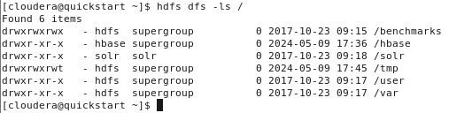
Verificando la creación del nodo.

## Ejercicio 3 - Consultar Datos con Cypher
* Verifique si la película Batman Begins existe. Cree una relación ACTED_IN entre Michael Caine y dicha película en cuya relación Michael Caine tuvo el rol de Alfred Penny.

No existe la película.
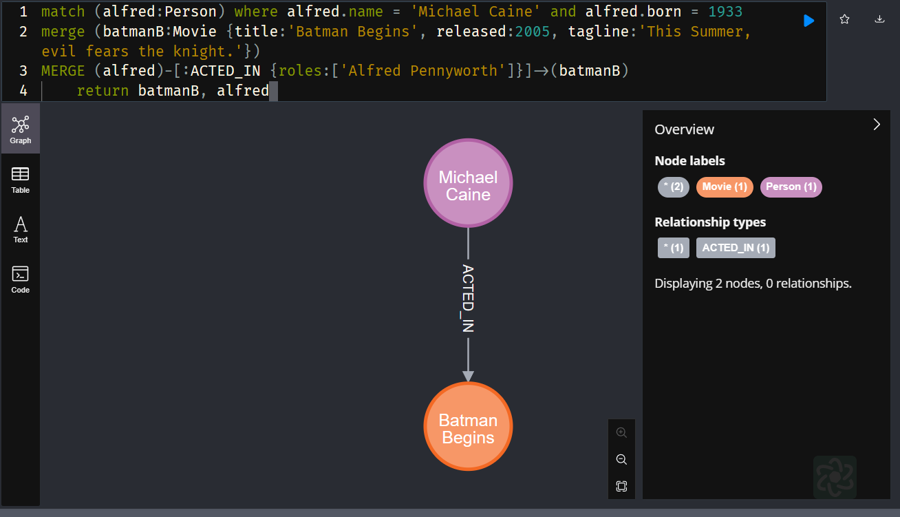
Cree la película y generé la relación entre Michael Caine y Batman Begins.

Verificando que sale en la lista de películas actuadas de Michael Caine.
* Ahora, como usted es un amante del cine, sabe que este mismo actor también tuvo el mismo rol con la película The Dark Knight. Agregue el rol a esta relación de la misma manera.
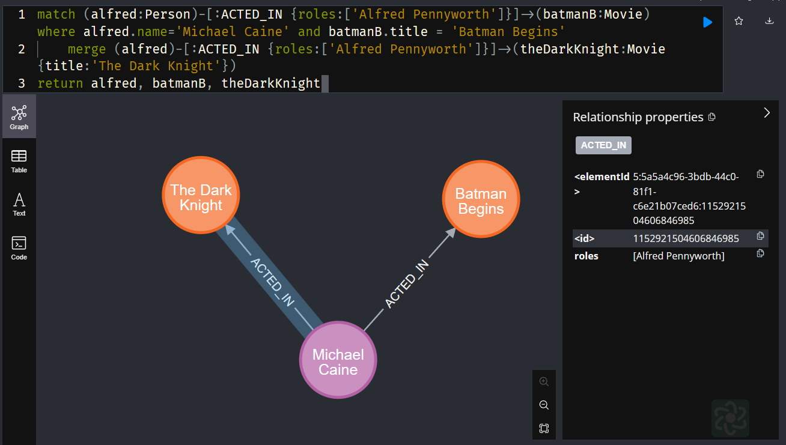
* Ahora, actualice también dicha relación para la misma película y el mismo actor en donde agregue que el año de esa actuación fue en 2008
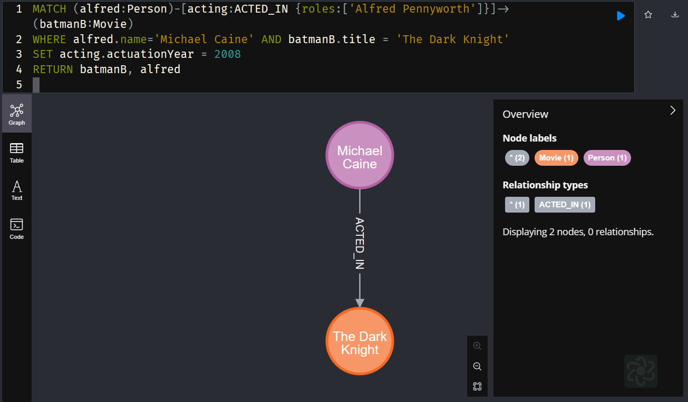
* Se dio cuenta que realmente por el volumen de películas que hay, será bastante laborioso el actualizar los roles de todos los actores que actuaron en la película. De esta manera, elimine el rol de Michael Caine con la película The Dark Knight utilizando la función REMOVE.
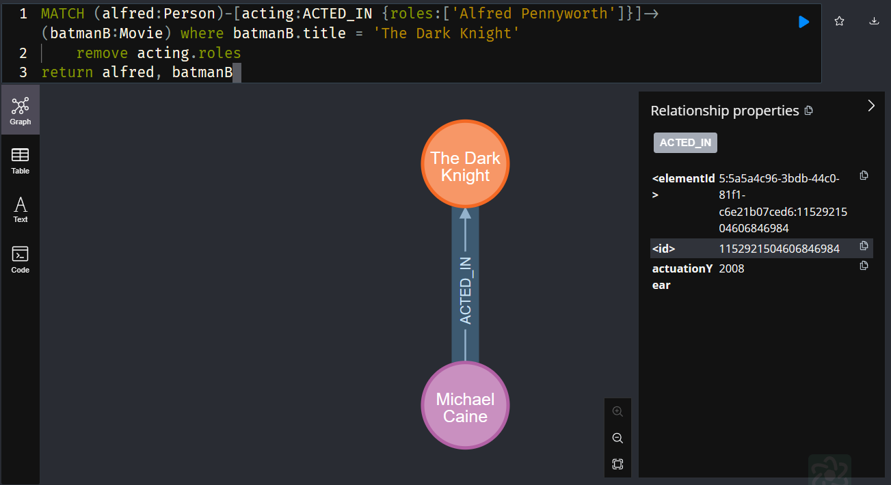
* Ahora, agregue un nuevo nodo persona Jane Doe con una relación de ACTED_IN a la película de The Matrix.
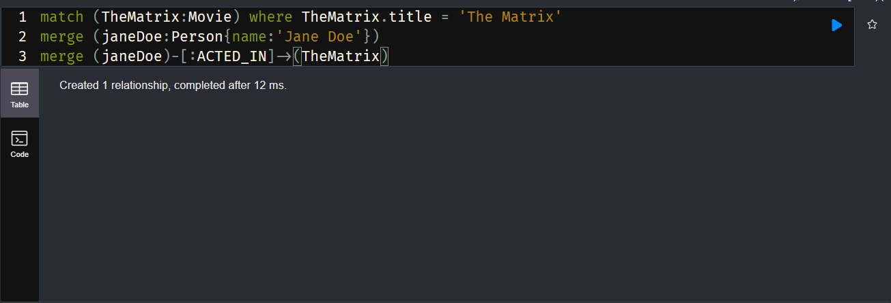
Verificando su creación es:
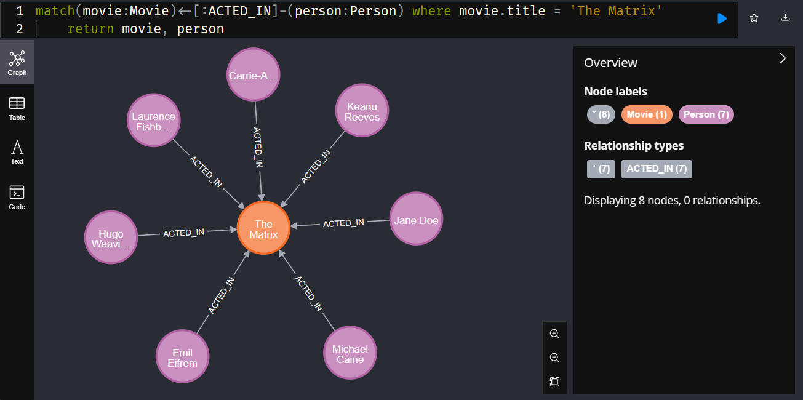
* ¿Qué otras personas tienen esta relación con dicha película?
De manera que algunas personas relacionadas con la película son 
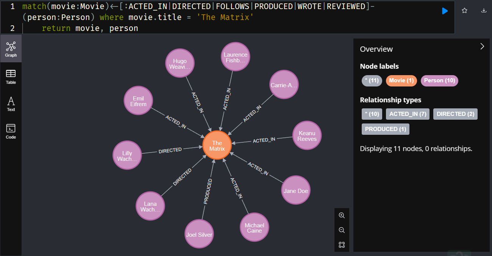
* Basado en sus conocimientos, sabe que Tom Cruise ha estado muy involucrado en muchas películas, no solo desde el rol de actor sino como de director. Verifique si esto es cierto, ejemplificando todas las relaciones que tiene este con todas las películas.
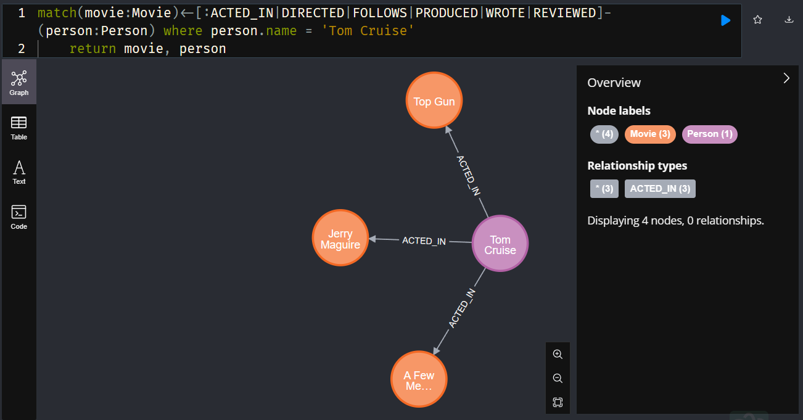
*  Para cerrar con broche de oro, elimine todo en la base de datos de prueba.
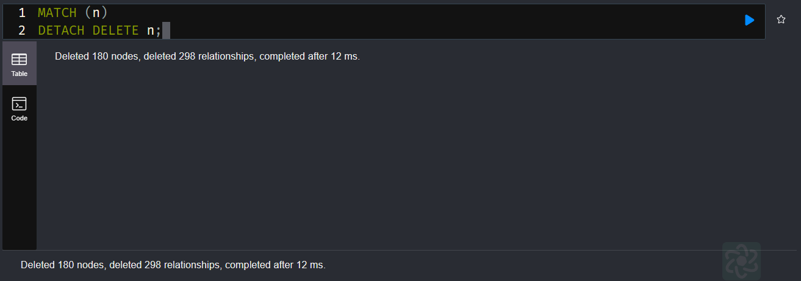
