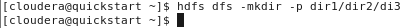
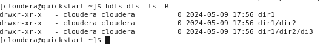

# Lab 7
Inicializar

## EJERCICIO 01
hdfs dfs

hdfs dfs --help

hdfs dfs --help ls

hdfs dfs -ls file:///usr

hdfs dfs -ls hdfs:///user

hdfs dfs -ls /user

## EJERCICIO 02

hdfs dfs -ls /

hdfs dfs -ls

hdfs dfs -mkdir -p dir1/dir2/dir3

hdfs dfs -ls dir1

hdfs dfs -ls /user/cloudera/dir1

hdfs dfs -ls -R

## EJERCICIO 03
